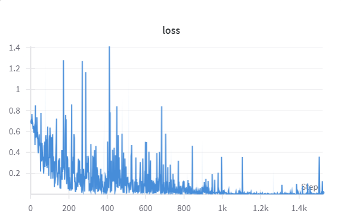
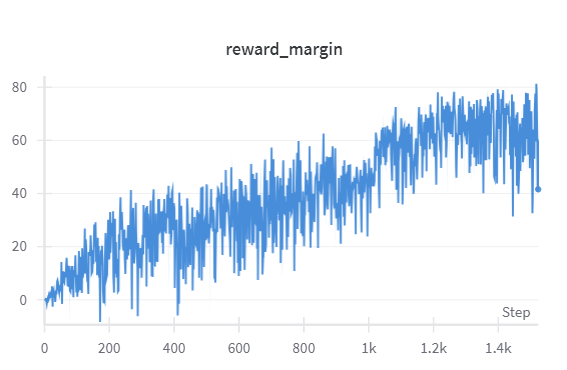

# DPO实战项目-基于Pytorch的原生实现
## 项目概述
**本项目从零实现了一个基于PyTorch的直接偏好优化(DPO)训练框架，通过原生PyTorch实现了完整的DPO算法流程，不依赖TRL等现成训练器**。完整代码库包含从数据预处理到模型训练的全流程实现，适用于需要深度定制DPO训练的场景。核心特点包括：

1. **原生PyTorch实现**：
   - 完全基于PyTorch生态构建，避免使用TRL等封装库
   - 自主实现关键组件：
     ```python
     # DPO核心损失计算
     def calculate_DPO_loss(model_prefered_logprob, model_disprefered_logprob,
                            ref_prefered_logprob, ref_disprefered_logprob,
                            beta=0.5):
     
         prefered_relative_logprob = model_prefered_logprob - ref_prefered_logprob
         disprefered_relative_logprob = model_disprefered_logprob - ref_disprefered_logprob
     
         reward_accuracies = (prefered_relative_logprob > disprefered_relative_logprob).float().mean(dim=-1)
         reward_margins = (prefered_relative_logprob - disprefered_relative_logprob).mean(dim=-1)
     
         loss = -F.logsigmoid(beta * (prefered_relative_logprob - disprefered_relative_logprob)).mean(dim=-1)
     
         return loss, reward_accuracies, reward_margins
     ```
   - 包含完整的训练循环、梯度累积和监控逻辑

2. **数据集说明**
   - truthy-dpo-v0.1数据集，包含人工标注的偏好对
   - 覆盖多种任务类型：事实性问答、安全响应、有用性排序
   - 数据集示例：
     ```
     {
         "prompt": "What color angers bulls and causes them to charge?",
         "prefered_response": "It is not the color that causes bulls to charge, but the perceived threat by the matador. Bulls are      dichromats, meaning they don't see red as a bright color. The misconception comes from the use of red capes in bullfighting,      leading people to assume that the color itself is what enrages the animal.",
         "disprefered_response": "Red"
     }
     ```

## DPO原理概述
首先简要介绍下DPO算法原理：
直接偏好优化（DPO）是一种高效且有前景的大语言模型微调技术，能够使模型输出更符合人类偏好。相比传统的基于人类反馈的强化学习（RLHF），DPO无需单独训练奖励模型，简化了训练流程，具有更好的稳定性和计算效率。

直接偏好优化的核心创新在于：通过数学变换，用闭式解替代RLHF中复杂的奖励建模过程。该方法**直接利用偏好数据集，增加人类偏好响应中token的对数概率，同时降低非偏好响应中token的对数概率，从而构建隐式奖励函数**。这种巧妙的数学处理使得优化过程比RLHF更简单高效——既不需要单独训练奖励模型，也避免了PPO等复杂强化学习算法的使用，显著提升了训练稳定性。

DPO损失函数定义如下：

$$
L_\text{DPO}(\pi_{\theta}; \pi_\text{ref}) = -E_{(x, y_w, y_l)\sim D}\left[\log \sigma \left(
\beta \log \frac{\pi_{\theta}(y_w\mid x)}{\pi_\text{ref}(y_w\mid x)} \thinspace
{- \beta \log \frac{\pi_{\theta}(y_l\mid x)}{\pi_\text{ref}(y_l\mid x)}}\right)\right]
$$

其中：

- $\pi_{\theta}$ 表示待微调的语言模型
- $\pi_\text{ref}$ 是参考模型（通常为预训练模型的冻结版本）
- $D$ 表示偏好数据集
- $x$ 是来自数据集 $D$ 的输入提示
- $y_w$ 是人类偏好的对应 $x$ 的响应
- $y_l$ 是人类不偏好的对应 $x$ 的响应
- $\beta$ 是控制模型偏离参考程度的超参数

该损失函数包含两个关键项：第一项表示人类偏好响应 $y_w$ 的对数概率。该项通过最大化 $\pi_{\theta}$ 生成 $y_w$ 的相对概率（与参考模型 $\pi_{\text{ref}}$ 相比）来实现优化。除以 $\pi_{\text{ref}}$ 的操作起到正则化作用，防止微调过程过度偏离原始模型。第二项则用于最小化非偏好响应 $y_l$ 的对数概率，通过降低模型生成此类响应的倾向来实现优化。

超参数 $\beta$（通常取值0.1至0.5之间）控制模型与参考模型 $\pi_\text{ref}$ 的偏离程度，在保持参考模型基本特性的前提下实现可控调整。最终损失通过对数据集 $D$ 或其中批次样本计算平均值获得，随后可通过梯度下降法优化语言模型参数。

## 部署流程
### 创建并激活环境
```
conda create --name dpo python=3.10
conda activate dpo
```
### 安装相关库
```
pip install -r requirements.txt
```
### 执行训练
训练参数配置在run.sh中，目前默认的参数配置是：
```
    --epochs 3 \
    --batch_size 2 \
    --gradient_accumulation_steps 32\
    --max_length 256 \
    --lr 1e-6 \
    --beta 0.1 \
    --seed 2003 \
    --model_name "src/Qwen2.5-0.5B-Instruct" \
    --dataset_name "src/truthy-dpo-v0.1" \
    --wandb_project "truthy-dpo"
```
你可以根据自己的需求调整参数，比如不同的模型、数据集、超参数等。
直接运行run.sh即可
```
./run.sh
```
运行后终端会提示连接wandb，按照提示注册或登录即可。

训练过程可在wandb上实时监控，训练完成后loss图如下：



记录的reward margin的图像：



