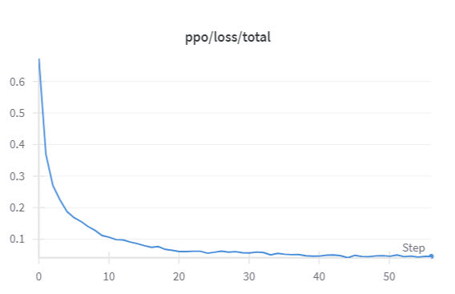
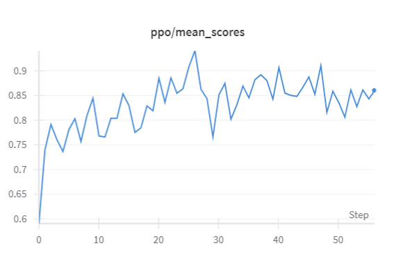

## 项目概述
本项目旨在演示如何利用**强化学习**技术对**大型语言模型 (LLM)** 进行**行为对齐微调**。具体而言，我们使用 **TRL (Transformer Reinforcement Learning)** 库实现了基于 **PPO (Proximal Policy Optimization)** 算法的训练流程，对 **Qwen2.5-0.5B-Instruct** 模型进行微调。

项目的核心目标是训练模型，使其在**续写电影评论片段**时，能够生成带有**积极（正面）情绪**的文本内容。我们通过集成一个预训练的**情感分析模型**作为**奖励模型**，为模型生成的文本提供反馈信号。PPO 算法将指导模型学习生成能够最大化这一积极情感奖励的序列。

训练过程中使用了 **IMDB 电影评论数据集**，从中提取评论前缀片段作为模型的输入 Prompt。整个训练过程的指标、配置和生成示例通过 **Weights & Biases (Wandb)** 进行实时监控和记录。

## 部署流程
### 创建并激活环境
```
conda create --name ppo python=3.10
conda activate ppo
```
### 安装相关库
```
pip install -r requirements.txt
```
### 运行训练

所有的训练逻辑和关键参数配置都在 `train_ppo_qwen.py` 这个 Python 文件中。运行此脚本将启动 PPO 微调过程。

本次训练的关键配置包括：
* **基础模型**: 使用的模型是 `Qwen/Qwen2.5-0.5B-Instruct`。
* **训练数据集**: 训练使用了 Hugging Face Hub 上的 `stanfordnlp/imdb` 数据集的 `plain_text` 配置。
* **Prompt 前缀长度**: 从原始评论中截取前 `MAX_PROMPT_TOKEN_LEN` (当前代码中设置为 10) 个 Token 作为输入片段。
* **生成回复长度**: 模型每次生成回复的最大长度限制为 `MAX_NEW_TOKENS` (当前代码中设置为 128) 个 Token。
* **情感奖励模型**: 使用 `distilbert/distilbert-base-uncased-finetuned-sst-2-english` 模型对拼接后的 Prompt + 生成结果进行情感评分，该分数作为 PPO 的奖励。
* **训练 Epochs**: 总共进行 `ppo_epochs` (当前代码中设置为 1) 个完整的数据集训练轮次。

要运行训练，请在激活 Conda 环境后执行以下命令：

```
python train_ppo_qwen.py
```

在Autodl运行可能遇到网络报错的问题，使用huggingface镜像：
```
export HF_ENDPOINT=https://hf-mirror.com
```

运行后终端会提示连接wandb，按照提示注册或登录即可。

训练过程可在wandb上实时监控，训练完成后loss图如下：



记录的平均奖励分数变化：



